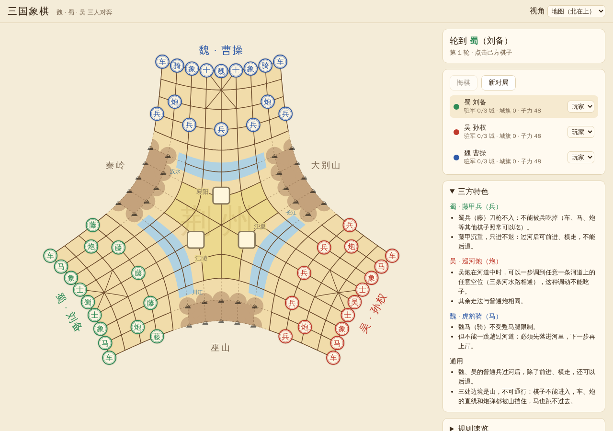

# 三国象棋

魏、蜀、吴三人对弈的中国象棋变体，网页版原型。



- 三方各有一块标准的象棋本土（含九宫），本土前方是河道，中间是荆州，三处边境是不可通行的山：秦岭、大别山、巫山。
- 棋盘采用「折线网格」：直线在中心折弯，车马炮兵的走法基本照搬中国象棋。
- 没有主动技能，三方各有一种特色棋子：魏「虎豹骑」不怕蹩马腿但不能一跳过河；蜀「藤甲兵」不怕兵但只进不退；吴「水军」：巡河炮在自家河道（长江）里平移不受棋子阻挡，吴兵通水性可一步直接过河。魏、吴的普通兵过河后可以后退。
- 吃将制 + 残部归降；三城驻军即「荆州霸业」获胜。

完整规则见 [docs/RULES.md](docs/RULES.md)。

在线试玩：<https://claude.ai/artifact/9FP7tfrJsF6YVyYgf1jcKG>（页面默认私有，需要在页面的「分享」菜单里开放后，别人才能打开）

## 运行

需要 Node.js 22.12 或更高版本。

```bash
npm install
npm run dev      # 本地开发，浏览器打开终端里显示的地址
npm test         # 规则引擎单元测试
npm run build    # 类型检查并打包到 dist/（纯静态文件，可直接部署）
npm run build:artifact   # 打包成单个自包含的 HTML 片段（dist/artifact.html），用于发布到 claude.ai
```

右侧面板可以把任意一方切换为「电脑」，一个人也能试玩；三个人可以在同一台电脑或平板上轮流走棋。
本地运行时网址加上 `?delay=0` 可以让电脑立即走棋，方便观看电脑对局。手机上可以用棋盘下方的「＋」放大棋盘。

## 目录

```
src/engine/   规则引擎（与界面无关，可单独测试）
  board.ts      棋盘拓扑：节点、直线、格子、区域与地形
  rules.ts      走法生成、地形与特色棋子、将军判定、出局与胜负
  factions.ts   三方数据与可调参数
  ai.ts         简易电脑对手
src/ui/       网页界面
  geometry.ts   把棋盘拓扑映射到平面（极坐标压缩，每方 120°）
  render.ts     SVG 绘制
  main.ts       交互与对局流程
tests/        单元测试（vitest）
scripts/      发布用的打包脚本
docs/         规则文档
```

## 后续可以做的

- 实际试玩后调整平衡（参数集中在 `factions.ts` 和 `board.ts`）
- 联网对战（三人各用自己的设备）
- 计策牌、名将棋子等扩展规则
- 更强的电脑对手
